# Yaakov Miller 👋

**`Software Formulator`**
[Credily Badges](https://www.credly.com/users/yaakov-miller)

I'm a dedicated full-stack developer with a fervent passion for data, automation, and emerging technologies. My journey in tech has taken me from crafting sleek, responsive static websites to orchestrating robust cloud deployments. Along the way, I've built versatile standalone applications that run seamlessly across multiple operating systems and engineered efficient gRPC server/client architectures. My work is driven by a commitment to innovation and a keen interest in the latest technological advancements, always seeking new challenges and opportunities to learn and grow.

---
### 🧰 Languages and Tools

  
  
  

  
  
  

  
  
  

  
  
  

  
  
  

  
  
  

    
    

 
 

  
 

 
 
 

#
### 📊 Stats 

#
<!--
**y44k0v/y44k0v** is a ✨ _special_ ✨ repository because its `README.md` (this file) appears on your GitHub profile.

Here are some ideas to get you started:

- 🔭 I’m currently working on ...
- 🌱 I’m currently learning ...
- 👯 I’m looking to collaborate on ...
- 🤔 I’m looking for help with ...
- 💬 Ask me about ...
- 📫 How to reach me: ...
- 😄 Pronouns: ...
- ⚡ Fun fact: ...
-->
